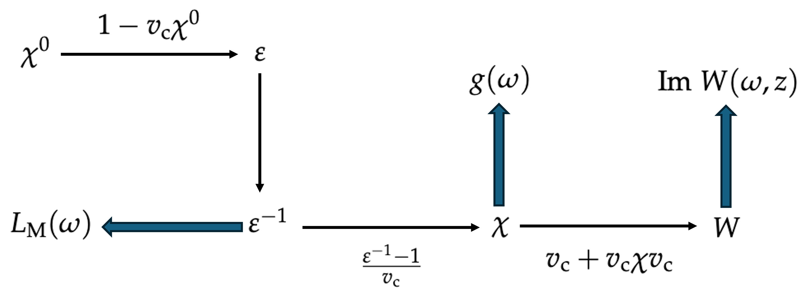

### Read Me File
### SURFASCOPE: 1D potential solver to obtain dielectric properties of 2D periodic jellium systems.

## Presentation of the code:

This code helps anyone with a given 1D potential to obtain the different dielectric response of the corresponding jellium system in mixed space representation: the code considers problems with a periodicity in the $x-y$ plane so the 1D potential is define along the $z$ axis. The in-plane composants must have a rotational symmetry so they can be analyzed in reciprocal space with the single variable $q_{||}$. The different dielectric responses computed include:

-  the irreducible density response function, $\chi^0(q_{||}, \omega; z, z')$,
- the reducible density response function, $\chi(q_{||}, \omega; z, z')$,
-  the dielectric function and its inverse, $\varepsilon(q_{||}, \omega; z, z')$ and $\varepsilon^{-1}(q_{||}, \omega; z, z')$,
-  and the screened interactions, $W(q_{||}, \omega; z, z')$.

Two functions are aslo implemented to obtain the SPP response of the system. The first one is called the \textit{surface response function}, $g(\omega)$ and modelize the response of the system if an electron travels in the $x-y$ plane at $z=z_{\text{max}}$. It simulates the response of an EELS measurement in an \textit{aloof} configuration. The second function is the \textit{macroscopic loss function}, $L_{\text{M}}(\omega)$. It is not a surface response but it uses the fact that the plasmon modes are nonetheless associated to the eigenvalues of the dielectric function to determine them. It is able to resolve the symmetric mode and bulk mode of any system. The antisymmetric mode are not shown with this method.

All the methods are defined using atomic units. The code uses python v3.11.

The code is organized as follow:

jellium.py allows to create a jellium_slab object where all the routines are automatized. This object requires a 1D potential, pot (np.array, real), the grid on which it is defined, z_vec (np.array, real), a number of charge defined as dens*d (float*float), the parallel wavevector component, qp (float), the frequency grid, omega (np.array) and the damping factor, eta (float).

With this object, the properties are computed using jellium._diel_properties(). It is also possible to add only specific dielectric function. The diagram below summarize how the different quantities are computed.

Most of the routines are defined in diel_1D.py, while tools.py is a series of convenient functions (Fourier transforms, vector manipulation, etc...).
vis_help.py is a series of figure template to simplify the visualozation of the results.

Two scripts still have to be uploaded: an SCF algorithm and a script to automatize the analyzes of a system with respect to a given parameter (pot, dens or qp).

### Installation

The scripts are build using python 3.11. The requirements.txt file include the installation of jupyter lab. If you don't want to install the jupyter lab, here is the list of the essential python packages to install and/or upload to run the code:

- numpy 2.1.0 (compatible version with numba)
- numba 0.61.0 (to compile the most time consuming steps of the computation)
- plotly 5.24.1 (to produce the figures of the results)
- dash 2.18.2 (optional; needed for the application summerizing the results, still to be added in the repository)

### Examples

TO DO

### 
